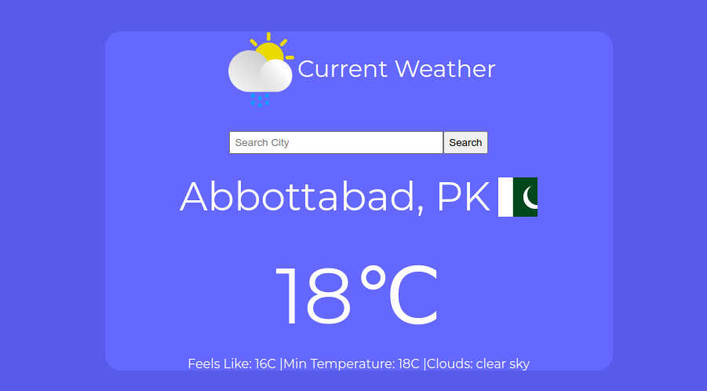

# Weather API 

> This repository contains source of a Weather app built using Javascript and API from <a href = 'https://openweathermap.org/'>OpenWeather API</a>.
 User can srarch for the weather by city.
 App shows Temperature in Celsius and other conditions like minimum temperature and Cloud condition.

## Set Up Project Locally

**To get this project set up on your local machine, follow these simple steps:**

**Step 1** 
Navigate through the local folder where you want to clone the repository and run 
`git@github.com:SajjadAhmad14/JS-Weather-app.git` to clone the repo to your local folder. 
or with https 
`https://github.com/SajjadAhmad14/JS-Weather-app.git`. 
**Step 2** 
Run `cd JS-Weather-app` 
**Step 2** 
Run `npm install` 

## Built With

- Javascript
- Webpack
- HTML
- CSS
- VScode
- Netlify

## Live Demo

<a href = '' target = 'blank'>Live Demo</a>

## Authors

👤 **Sajjad Ahmad**

- GitHub: [@githubhandle](https://github.com/SajjadAhmad14)
- Twitter: [@twitterhandle](https://twitter.com/Sajjad_Ahmad14)
- LinkedIn: [LinkedIn](https://www.linkedin.com/in/sajjadahmad14)

## 🤝 Contributing

Contributions, issues, and feature requests are welcome!

Feel free to check the [issues page](https://github.com/SajjadAhmad14/JS-Weather-app/issues).

## Show your support

Give a ⭐️ if you like this project!

## 📝 License

This project is [MIT](lic.url) licensed.